

  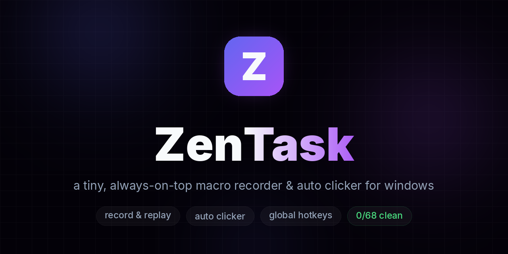

&nbsp;
&nbsp;
&nbsp;
 

**a tiny, always-on-top macro recorder & auto clicker for windows.** 
record your mouse and keyboard, loop it, hotkey it, save it. 
no account, no telemetry — just press record.

[**⬇ download for windows**](https://github.com/sitezu/Zentask/releases/latest/download/ZenTask-Setup-1.0.6.exe) · [🌐 website](https://sitezu.github.io/Zentask/) · [📦 all releases](https://github.com/sitezu/Zentask/releases)

  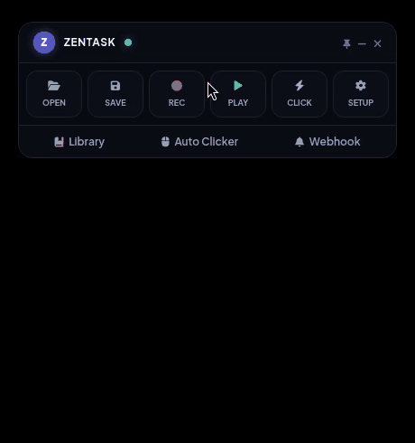
   real capture — it records the circle once, then replays it on its own

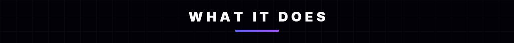

| | |
|:---:|:---:|
| 🎥 **record & replay** captures mouse moves, clicks and keystrokes. loop a set number of times or forever, with fine-tuned speed control. | 🖱️ **auto clicker** adjustable clicks-per-second, any button, single or double click. follow your cursor dynamically or click a fixed coordinate. |
| 🗂️ **macro library** save macros with the native windows save-as dialog, rename them with the pen icon, load them instantly anytime. | ⌨️ **global hotkeys** record, play, pause and clicker hotkeys that execute in any app — you never have to touch the widget. |
| 📌 **always on top** compact, draggable widget that stays out of your way. custom themes, light mode and system tray support. | 🖥️ **dpi aware** hardware-level scaling keeps your recordings perfectly accurate at 125%, 150% and beyond. |

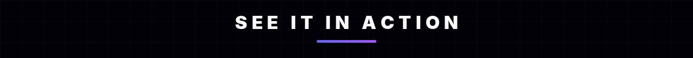

<table>
<tr>
<td width="33%" align="center">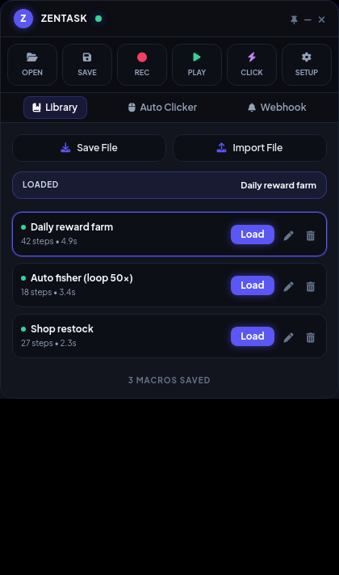 macro library — save, rename, load</td>
<td width="33%" align="center">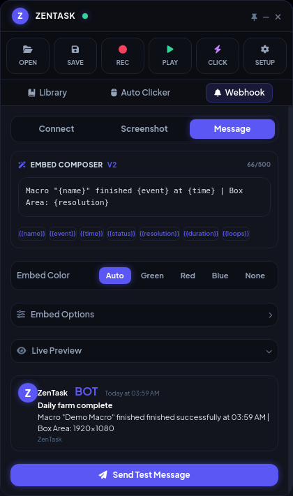 webhook embed composer + live preview</td>
<td width="33%" align="center">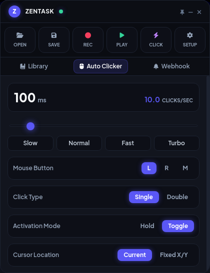 auto clicker</td>
</tr>
</table>

more screens

<table>
<tr>
<td width="50%" align="center">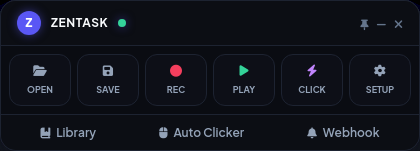 the widget, always on top</td>
<td width="50%" align="center">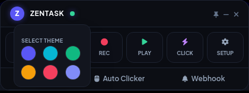 themes, one click away</td>
</tr>
</table>

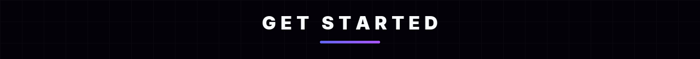

1. install and open it
2. click the record button (or press the record hotkey)
3. do the clicks / keys you want to automate
4. press the hotkey again to stop
5. hit play — or save it to your library first

that's the whole manual. settings has hotkey remapping, loop count,
playback speed and startup options if you want to go deeper.

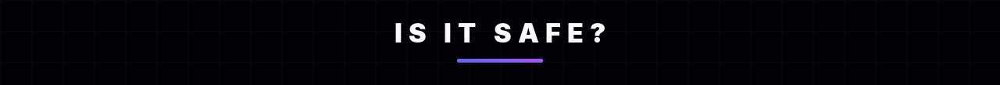

> ✅ **virustotal: 0/68 engines flagged it — clean.**
> [see the scan yourself](https://www.virustotal.com/gui/file/e130a9a6d4128aa824091a3dd5be4539c185866a844e7f055571b8d971602d2b)
>
> ⚠️ windows smartscreen might still say "unknown publisher" — i don't pay
> for a code signing certificate on a free project, so that's expected.
> to confirm you downloaded the exact file that was scanned:
>
> `SHA256: e130a9a6d4128aa824091a3dd5be4539c185866a844e7f055571b8d971602d2b`
>
> powershell: `Get-FileHash .\ZenTask-Setup-1.0.6.exe`

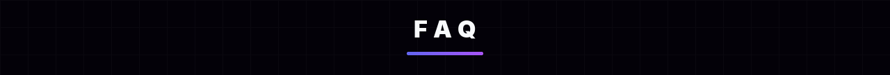

**antivirus flagged it?** — it's 0/68 on virustotal (link above), so a flag
on your machine would be a false positive on the unsigned exe. re-upload it
to virustotal and compare the SHA256 if you want proof it's the same file.

**can i use it in games?** — it simulates normal mouse/keyboard input, but
whether a specific game's anti-cheat allows that is between you and the
game. use your judgment.

**something's broken / i want a feature?** — open an issue here or tell me
wherever you found this. i'm actively working on it.

---

if this saved you time, a ⭐ on the repo helps other people find it. 
MIT license — do whatever you want with it. 
made with 💜 by <a href="https://github.com/sitezu">sitezu</a>

